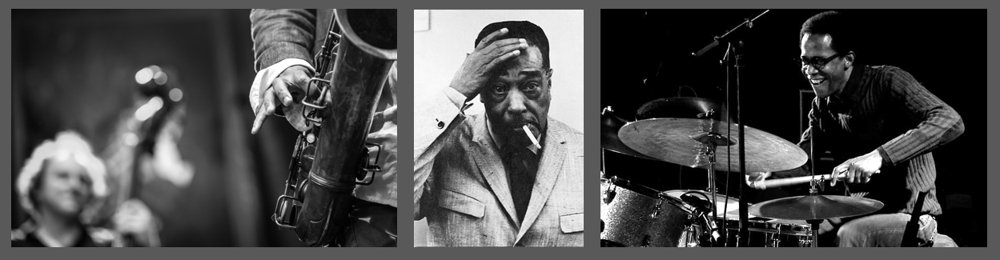
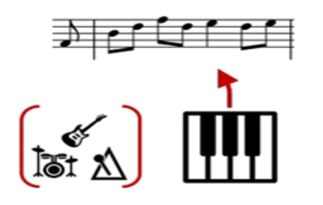
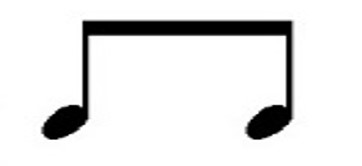
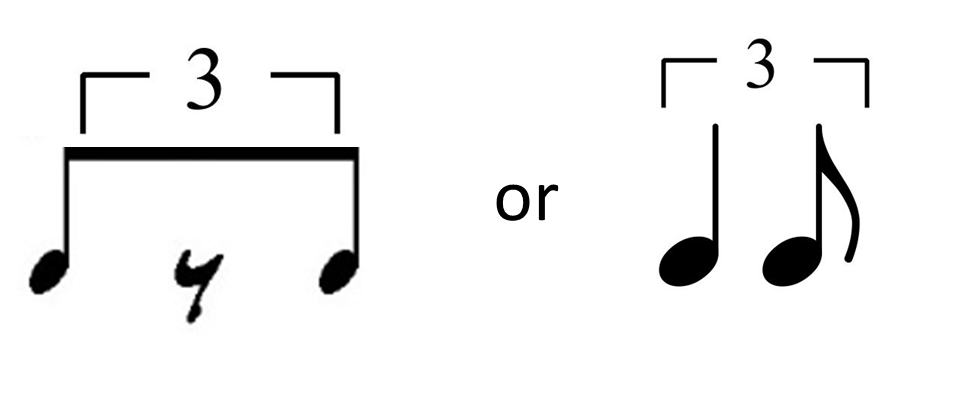
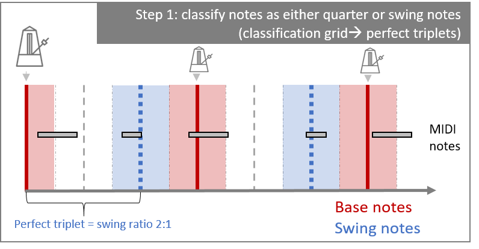
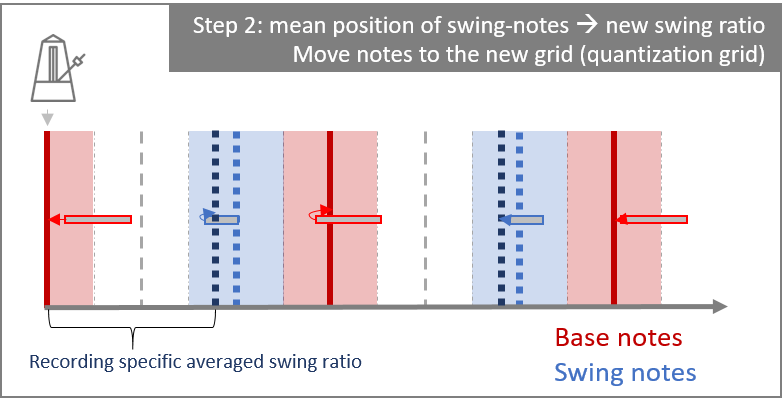
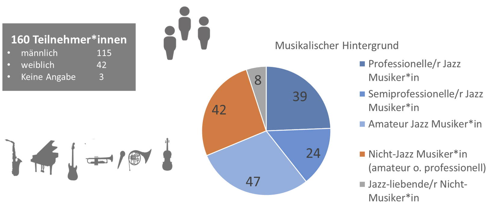
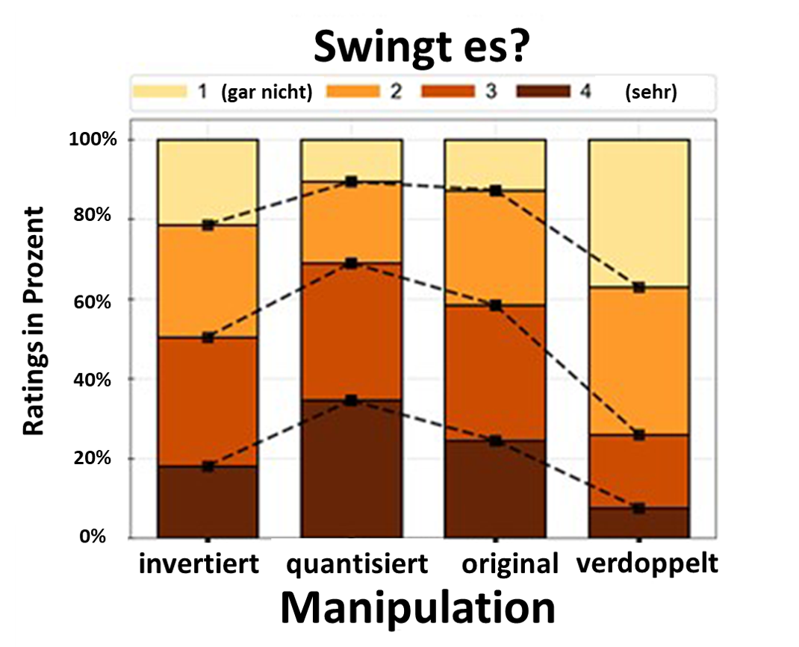
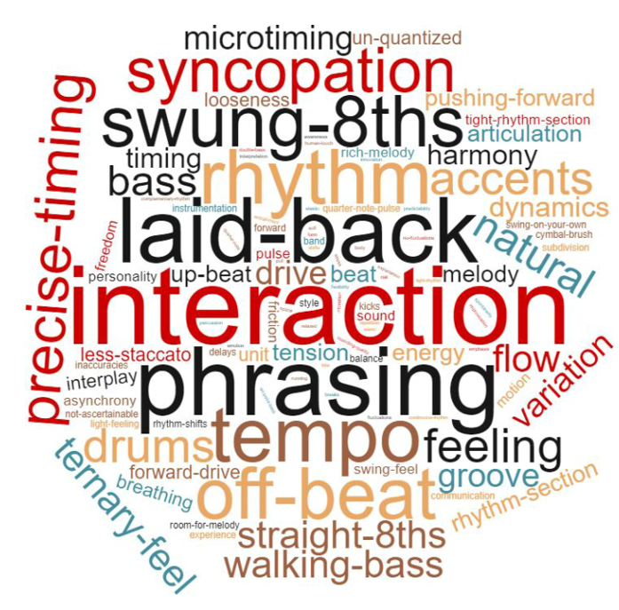

### Link zur Publikation

Den Forschungsartikel auf Englisch & weitere Informationen sowie alle Musikbeispiele finden Sie frei zugänglich hier: 
 [Nature Scientific reports](https://www.nature.com/articles/s41598-019-55981-3).
 
Zitation: Datseris, G., Ziereis, A., Albrecht, T., Hagmayer, Y., Priesemann, V., & Geisel, T. (2019). Microtiming Deviations and Swing Feel in Jazz. *Scientific Reports, **9(1)***, 1-10.  [doi:10.1038/s41598-019-55981-3](https://doi.org/10.1038/s41598-019-55981-3)
 

# Swingt es?

„It Don’t Mean a Thing, If It Ain’t Got That Swing" meinten Duke Ellington und Irving Mills bereits in ihrem bekannten Jazz Standard aus dem Jahr 1931. Aber was bringt ein Jazzstück eigentlich zum swingen? 
In einer experimentellen Onlinestudie sind wir, eine Forschergruppe des Max-Planck-Instituts für Dynamik und Selbstorganisation und des Georg-Elias-Müller Instituts für Psychologie in Göttingen, dem Phänomen auf den Grund gegangen. Insbesondere sehr kleine Fluktuationen im Rhythmus (*Microtiming Deviations*) und deren Einfluss auf das *swing feel* standen hierbei im Fokus. 
Im ersten Schritt nahmen wir bekannte Jazzstücke gespielt von einem professionellen Jazzmusiker auf. Dann untersuchten wir die *Microtiming Deviations* des Pianisten veränderten diese systematisch. In einem zweiten Schritt präsentierten wir die originalen und veränderten Versionen der Stücke professionellen und Amateur- Musiker&ast;innen (mit Jazz oder klassichem Hintergrund) und ließen die Stücke danach bewerten, inwiefern sie natürlich oder fehlerhaft klängen und wie sehr sie swingen. 
Die Teilnehmer&ast;innen der Studie bewerteten im Schnitt die quantisierten Versionen der Stücke (also diejenigen ohne Microtiming Deviations) als am meisten swingend (bei ein paar Stücken sogar ein wenig mehr als die originalen Versionen). Diejenigen Versionen, bei denen die Microtiming deviations verdoppelt wurden, wurden als am wenigsten swingend eingestuft. Anders als wir ursprünglich erwarteten, hatte eine weitere Manipulation (Inversion der Microtiming deviations) lediglich bei zwei Stücken einen Einfluss auf die Bewertungen. 

## Hintergrund und Motivation

Wenn ein Musikstück swingt, ruft es beim Zuhörenden ein angenehmes Körpergefühl und den Wunsch hervor, sich zur Musik zu bewegen. Sei es ein Wippen mit dem Fuß oder Nicken ... man wird von der Musik ein Stück weit mitgerissen. Es ist aus wissenschaftlicher Sicht schwierig, das *swing feel* (oder sein verwandtes Konzept *groove*) zu definieren. Musiker&ast;innen und viele Musikbegeisterte haben aber intuitiv ein Gespür dafür, was es bedeutet und die Allermeisten haben es schon selbst erlebt.  
In der musikwissenschaftlichen Forschung wurde seit einigen Jahren versucht, Eigenschaften von Musikstücken zu identifizieren, die groove beeinflussen. Hierbei gab es zwei Ansätze: 
1) die Analyse von bestimmten Eigenschaften (z.B. Tempo, swing ratio (Erklärung s.u.), spezifischer Stil) von Musikstücken von bekannten und swingenden Musiker&ast;innen und 
2) die experimentelle Manipulation von einzelnen Faktoren, die dann Hörer&ast;innen vorgespielt und von ihnen bewertet wurden.

Die unterschiedlichen Ansätze wurden von unterschiedlichen Forscher&ast;innen verfolgt und führten zu unterschiedlichen Ansichten bezüglich der Rolle von Microtiming deviations (also die kleinen rhythmischen Abweichungen). 
Ob diese notwendig sind, um ein Stück swingen oder grooven zu lassen, wurde besonders in den letzten Jahren stark debattiert.
Auf der einen Seite wurden Microtiming Deviations bei swingenden Musiker&ast;innen immer gefunden und ihnen wurden spezifische Funktionen zugeschrieben. Auf der anderen Seite fand man in Hörexperimenten keinen oder sogar einen negativen Einfluss von Microtiming Deviations  auf groove.  
Da Verfechter&ast;innen der notwendigen Microtiming deviations sich vor allem auf Jazz Musik beziehen und in den experimentellen Hörstudien eher andere Musikgenres untersucht wurden (z.B. Rock, Samba, Funk), wollten wir uns den Einfluss von Microtiming Deviations speziell für Jazz genauer ansehen. Außerdem wollten wir keine künstlichen Microtiming Deviations generieren, sondern die Microtiming Deviations untersuchen, die natürlicherweise von einem Solisten gespielt werden.

## Vorgehensweise
### 1. Aufnahme der Jazzstücke
 

Für die zwölf Musikstücke (alles Jazz standards) nahmen wir einen professionellen Pianisten auf. Während er spielte, hörte er über Kopfhörer einen quantisierten Track (ohne Microtiming Deviations) mit Bass und Schlagzeug als Tempogeber, welcher sozusagen die Funktion eines Metronoms übernahm aber dabei natürlicher klang. 

### 2. Systematische Manipulation der Aufnahmen
Die Manipulation der Aufnahmen erfolgte in mehreren Schritten. Da das Piano digital aufgenommen wurde, waren Anfang und Dauer einer gespielten Note sowie Intensität (Tastenanschlag) aufgezeichnet und konnten ebenfalls digital verändert werden. 
Zunächst aber mussten alle Noten und ihre Zählzeiten klassifiziert werden (also welche Note z.B. der erste Teil einer Triole (base note) und welcher der letzte Teil der Triole (swing note) ist). 

**Exkurs: Was bedeutet *swing ratio*?**
Swing ratio ist das Verhältnis der Länge zwischen Achtelnoten. Beim straight feel (wie man es z.B. aus der klassischen Musik kennt)  werden die Achtel duolisch gespielt (haben also die gleiche Länge). Die swing ratio wäre hierbei 1:1. 
 
 
 
Wichtig ist hierbei, dass die Länge nicht die eigentliche Dauer des Klangs ist, sondern lediglich anzeigt, wann die nächste Note einsetzt. Es spielt also keine Rolle ob die Note nur kurz oder länger angeschlagen wird. 
Eine swing ratio von 2:1 (perfekte Triole) würde die erste 8tel Note genau doppelt so lange dauern, wie die letzte. Die mittlere Note der Triole wird in der Regel nicht extra angespielt sondern mit der ersten verbunden oder durch eine Pause ersetzt. Das kann folgendermaßen notiert werden:
 
 
 
In der Realität und von Musiker&ast;innen gespielt sind swing ratios weder perfekt konstant noch liegen sie unbedingt genau bei 2:1 sondern können je nach Präferenz auch weicher (<2:1) oder härter sein (>2:1). Zusätzlich muss der Beginn der ersten 8tel nicht perfekt auf Schlag liegen sondern kann früher oder später kommen. 
 

Um die Noten unseres Pianisten zu klassifizieren nahmen wir den quantisierten Track mit Bass und Schlagzeug als Referenz. Da die swing ratio des Tracks exakt 2:1 (perfekte Triole) war, wurden alle Noten entsprechend ihrer Nähe zu diesem Raster eingeteilt (siehe Bild unten). Die Noten wurden hierbei noch nicht verschoben sondern nur kategorisiert. 

 
Schematische Darstellung der Notenklassifizierung: Das Raster wurde in drei Bereiche eingeteilt (rot = base note / erste 8tel,  weiß = mittlere 8tel / pause, blau = swing note / letzte 8tel). Wenn der Beginn der gespielten Note (Noten sind hierbei als graue Balken angezeigt) in einen der Bereiche fällt, wird sie dementsprechend klassifiziert. Für die Klassifikation spielt die Länge der Note (Länge des Balkens) keine Rolle sondern nur der Beginn (Anfang des Balkens). 

**Berechnung der durchschnittlichen swing ratio**
Für jedes Stück wurde nun auf Basis der zeitlichen Position der swing notes die durchschnittliche swing ratio berechnet.
Beispielsweise hatte das Stück "So What" eine durchschnittliche swing ratio von 1.57:1, während das Stück "Don’t Get Around Much Anymore" eine durchschnittliche swing ratio von 2.11:1 hatte.

Auf Grundlage der berechneten durchschnittlichen swing ratio für jedes Stück wurden dann neue Raster (Quantisierungsraster oder quantization grid) für die Manipulationen der Microtiming deviations gebildet. 

***Microtiming deviations sind die Abweichung jeder einzelnen Note von einem definierten Raster, in unserem Fall von dem stückspezifischen Quantisierungsraster.***

**Manipulation der Microtiming deviations**
Jedes Stück wurde auf drei verschiedene Arten manipuliert: Hierbei wurden die Microtiming deviations... 
+ *quantisiert*, d.h. alle Variation der Notenanfänge wurde herausgenommen und die Noten wurden auf ein fixes Raster (quantization grid) verschoben. (siehe Bild unten)
+ *verdoppelt*, d.h. die zeitlichen Abstände zu dem fixen Raster wurden verdoppelt (d.h. die Microtiming deviations wurden doppelt so groß gemacht). Bsp.: Wenn in Takt 1 auf Zählzeit 1 in der originalen Version die swing note 3 Millisekunden vor der durchschnittlichen swing note des Stücks kam, so kam sie in der manipulierten Version 6 Millisekunden vor der durchschnittlichen swing note. 
+ *invertiert*, d.h. die Microtiming deviations haben das Vorzeichen gewechselt, sind aber in ihrem zeitlichen Abstand gleich weit vom fixen Raster entfernt wie im Original. Bsp.: Wenn in Takt 1 auf Zählzeit 1 in der originalen Version die swing note 3 Millisekunden *vor* der durchschnittlichen swing note für dieses Stück gespielt wurde, wurde sie in der invertierten Version um den gleichen Betrag also auch 3 Millisekunden *nach* der durchschnittlichen swing note gespielt. 

Schematische Darstellung der Quantisierung:

Das neue Quantisierungsraster zeigt als neue swing ratio (dunkelblau gestrichelte Linie) die durchschnittliche swing ratio für das jeweilige Stück an. In diesem Beispiel wäre die swing ratio kleiner (d.h. < 2:1) als für die Klassifizierung (hellblau gestrichelte Linie). 
Da Musiker&ast;innen, so geübt und professionell sie spielen können, selten konstant die exakt gleiche swing ratio zeigen (unabhängig davon, ob sie das überhaupt wollen), gibt es immer auch kleine Abweichungen von der durchschnittlichen swing ratio. 
Bei der Quantisierung werden alle Notenanfänge auf das neue Quantisierungsraster verschoben. Damit ist für jeden Takt und jede Zählzeit festgelegt, wann der Beginn jeder Note ist und die swing ratio ist konstant von Beginn bis Ende des Stücks. Die Länge und Intensität (der Anschlag) wurden nicht verändert. 

Für jedes Stück und für jede Manipulation wurden dann verschiedene Maße und Aspekte des Rhythmus untersucht. z.B. die durchschnittliche swing ratio, die mittlere Abweichung von der durchschnittlichen swing ratio (wie stark einzelne Noten variieren), das Tempo etc.. 

### 3. Experimentelle Onlinestudie
Die drei Manipulationen und die originalen Aufnahme ergaben zusammen vier Versionen für jedes Jazzstück, die wir testen wollten. Dazu erstellten wir eine Online-Hör-Studie und luden Musiker&ast;innen mit unterschiedlichem Hintergrund und Expertise ein (s:h. Graphik).
Die Teilnehmer&ast;innen hörten dabei alle zwölf Stücke aber es wurde zugelost, welche Version des Stücks sie jeweils hören konnten. 
Nach jedem Stück sollten sie bewerten, inwiefern es natürlich klang, ob es technisch korrekt gespielt wurde und wie sehr es swingt. 

### 4. Beispiele der gespielten Stücke und Versionen 

*Hinweis: Den Teilnemer&ast;innen unserer Studie haben wir natürlich nicht verraten, um welches Stück und um welche Version es sich handelt, um sie nicht zu beeinflussen.*

Im Folgenden können Sie vier Beispiele anhören (Welche Version eines Stück präsentiert wurde, finden Sie jeweils darunter unter "Auflösung") 
 
**Bsp. 1:**
<audio controls>
  <source src="getaround_0.mp3" type="audio/mpeg">
Your browser does not support the audio element.
</audio>

Auflösung Bsp. 1

Stück: Don't get around much anymore  
Version: quantisiert

 
**Bsp. 2:**
<audio controls>
  <source src="four_orig.mp3" type="audio/mpeg">
Your browser does not support the audio element.
</audio>

Auflösung Bsp. 2

Stück: Four  
Version: original

 
 **Bsp. 3:**
<audio controls>
  <source src="papermoon_2.mp3" type="audio/mpeg">
Your browser does not support the audio element.
</audio>

Auflösung Bsp. 3

Stück: It's only a papermoon 
Version: verdoppelt

 
 **Bsp. 4:**

<audio controls>
  <source src="mellow_-1.mp3" type="audio/mpeg">
Your browser does not support the audio element.
</audio>

Auflösung Bsp. 4

Stück: In a mellow tone 
Version: invertiert

**Bsp. 5: Alle Versionen des Stücks "Jordu" zum Vergleich**
original 
<audio controls>
  <source src="jordu_orig.mp3" type="audio/mpeg">
Your browser does not support the audio element.
</audio>

quantisiert 

<audio controls>
  <source src="jordu_0.mp3" type="audio/mpeg">
Your browser does not support the audio element.
</audio>

verdoppelt 

<audio controls>
  <source src="jordu_2.mp3" type="audio/mpeg">
Your browser does not support the audio element.
</audio>

invertiert 

<audio controls>
  <source src="jordu_-1.mp3" type="audio/mpeg">
Your browser does not support the audio element.
</audio>  

## Ergebnisse der Onlinestudie

Über alle Stücke hinweg swingten für die Teilnehmer&ast;innen die quantisierten Versionen ein wenig mehr als die originalen Aufnahmen. Fast gleich wie die originalen Versionen wurden die invertierten Versionen bewertet. Nur bei zwei Stücken wurden invertierte Versionen als signifikant weniger swingend eingestuft. 
Die Microtiming Deviations zu verdoppeln führte hingegen immer zu deutlich niedrigeren swing ratings. 

Wenn man sich die einzelnen Stücke anschaut, so wurden diese als unterschiedlich swingend eingestuft (unabhängig von der präsentierten Version). Es scheint daher noch mehr Einflussfaktoren zu geben als nur Microtiming deviations. Mögliche Interaktionen mit anderen Einflussfaktoren sind ebenfalls denkbar. 
Auch die Befragten unterschieden sich in ihrer Bewertung. Professionelle Jazzmusiker&ast;innen vergaben generell etwas niedrigere swing ratings - unabhängig von Stück und Version- , waren also strenger. Aber alle Musikergruppen vergaben Ratings in der folgenden Reihenfolge:

quantisiert > original & invertiert > verdoppelt
Der Effekt der Microtiming deviations auf das swing rating war für alle Musikergruppen gleich. 

### Was bringt ein Stück zum swingen? Die Antworten unserer Teilnehmer&ast;innen

Am Ende unserer Studie fragten wir unseren Teilnehmer&ast;innen, was ihrer Meinung nach ein Stück zum swingen bringt. 
Wir fassten ihre Schlagworte so zusammen, dass häufig genannte Begriffe größer dargestellt sind. Deutlich wird hierbei, dass der Rhythmus zwar eine große Rolle spielen mag, aber noch weitere Faktoren potentiell wichtig sein können und in weiterer Forschung untersucht werden sollten. 

